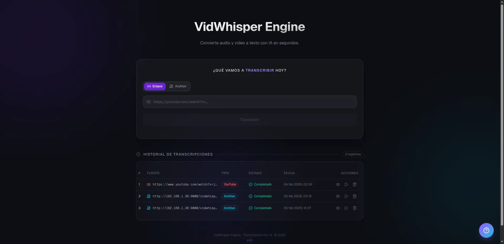
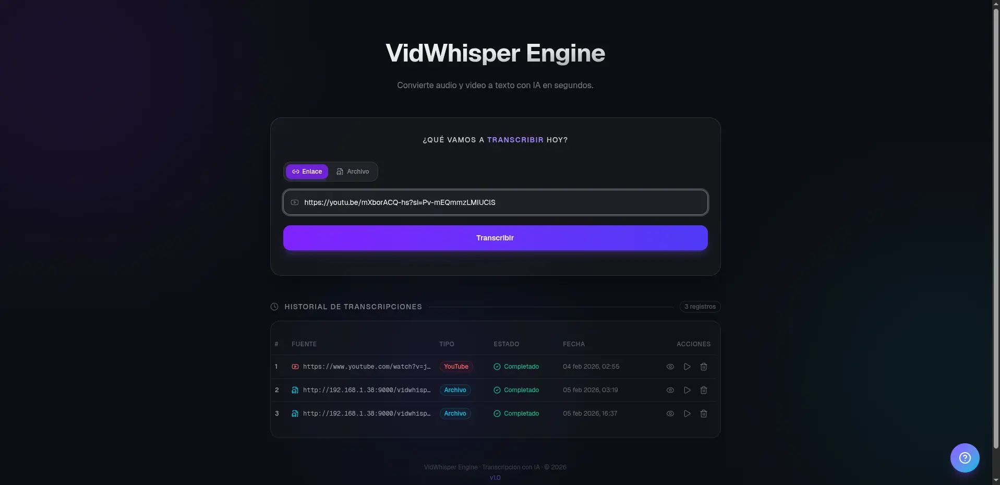
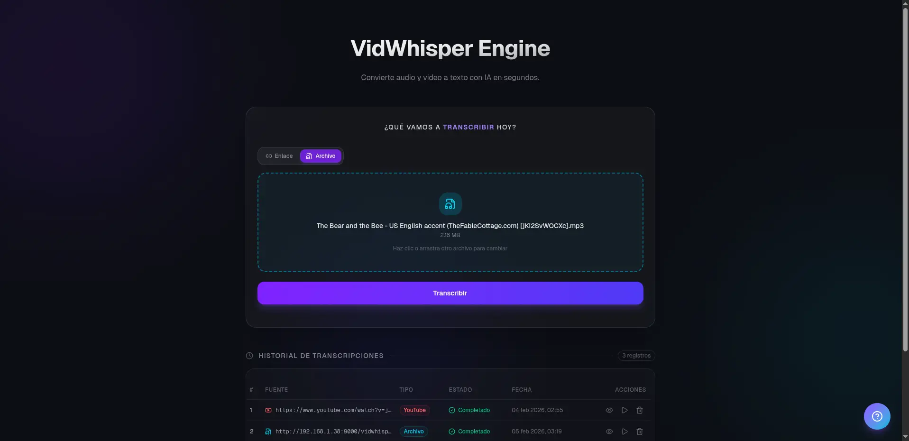
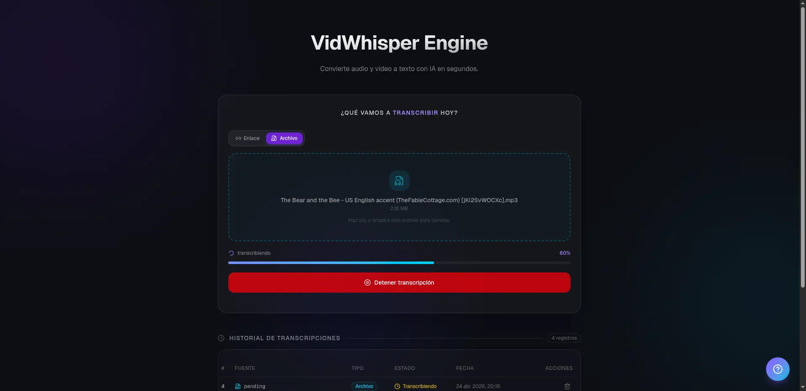
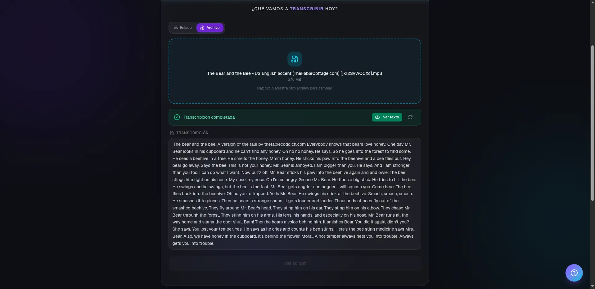
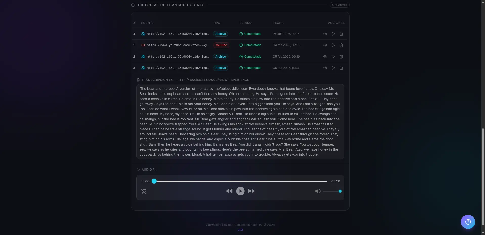
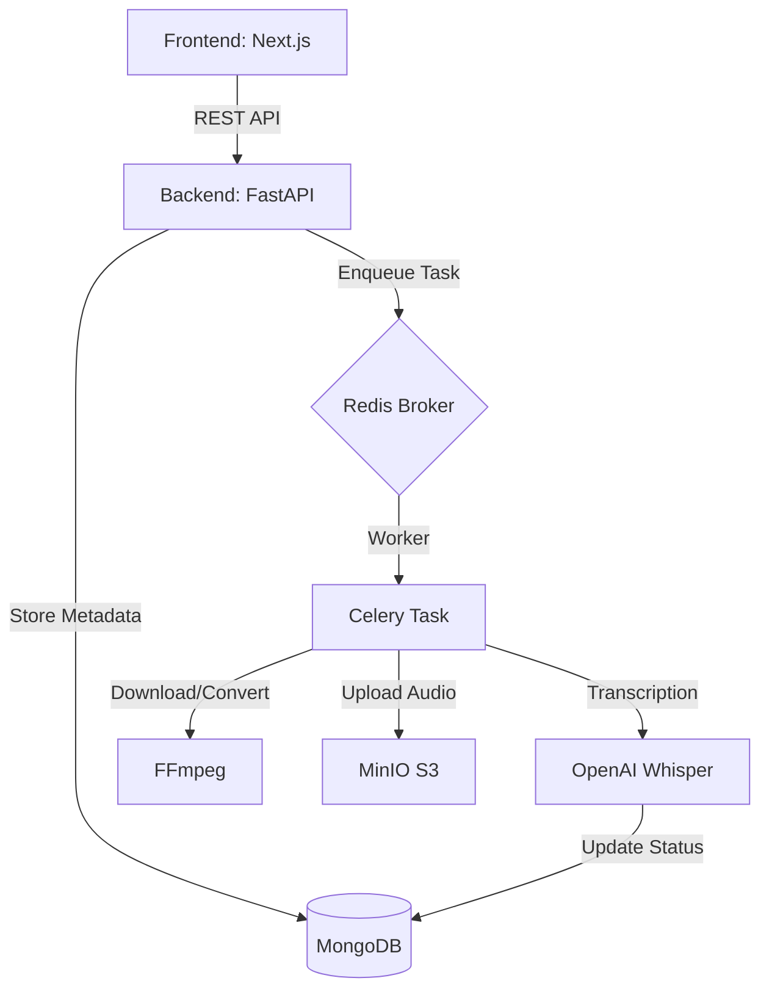

# VidWhisper Engine

<div align="center" style="background: black; height: auto; margin-bottom: 20px; padding: 10px">
    
</div>

<div align="center">


**A powerful, full-stack video & audio transcription platform powered by OpenAI Whisper**

[Features](#features) • [Tech Stack](#tech-stack) • [Quick Start](#quick-start) • [Architecture](#architecture) • [Contributing](#contributing)

</div>

---

## Overview

VidWhisper is a sophisticated, cloud-native transcription platform that converts video and audio files into accurate text transcripts. Built with modern technologies and designed for scalability, it supports direct URL transcription, file uploads, and streaming via MinIO, with real-time progress tracking.

**Perfect for:** Content creators, researchers, accessibility teams, and enterprises requiring bulk transcription.

---

## Features

- **Multi-source Transcription**
  - Direct URL support (YouTube, direct links)
  - File upload with drag-and-drop UI
  - Real-time transcription progress tracking

- **Production-Ready Architecture**
  - Distributed task processing with Celery + Redis
  - Scalable microservices using Docker Compose
  - Async/await patterns throughout for high concurrency

- **Enterprise Features**
  - Secure file storage with MinIO (S3-compatible)
  - MongoDB for persistent data management
  - RESTful API with proper error handling & validation

- **Internationalization**
  - Multi-language support (English, Spanish)
  - Responsive, accessible UI with Tailwind CSS

- **High Performance**
  - FFmpeg integration for optimized media conversion
  - Efficient audio extraction from videos
  - Smart caching strategies

---

## Tech Stack

### Backend

| Component        | Technology     | Version       |
| ---------------- | -------------- | ------------- |
| Framework        | FastAPI        | 0.128.0       |
| Task Queue       | Celery         | 5.4.0         |
| Message Broker   | Redis          | 5.0.8         |
| Database         | MongoDB        | (Motor 3.7.1) |
| Storage          | MinIO          | 7.2.20        |
| AI/ML            | OpenAI Whisper | 20250625      |
| Media Processing | FFmpeg         | 0.2.0         |
| Web Server       | Uvicorn        | 0.40.0        |

### Frontend

| Component        | Technology   | Version |
| ---------------- | ------------ | ------- |
| Framework        | Next.js      | 16.1.1  |
| UI Library       | React        | 19.2.3  |
| Styling          | Tailwind CSS | 4.0     |
| Components       | shadcn/ui    | Custom  |
| State Management | Zustand      | 5.0.11  |
| i18n             | next-intl    | 4.8.3   |
| Language         | TypeScript   | 5.x     |

### Infrastructure

- **Container Orchestration:** Docker & Docker Compose
- **Server:** Ubuntu/Linux (Python 3.11 base image)

---

## Quick Start

### Prerequisites

- Docker & Docker Compose
- Git

### Installation & Setup

1. **Clone the repository**

   ```bash
   git clone https://github.com/Edmendez-dev/vidwhisper-engine.git
   cd vidwhisper-engine
   ```

2. **Configure environment variables**
   - **Root directory and Backend:**

   ```bash
   # Create .env file in root directory and backend
   cat > .env << EOF
   # MongoDB
   MONGO_INITDB_ROOT_USERNAME=admin
   MONGO_INITDB_ROOT_PASSWORD=your_secure_password
   MONGO_INITDB_DATABASE=vidwhisper-db
   MONGODB_URI=mongodb:27017

   # MinIO
   MINIO_ENDPOINT=minio:9000
   MINIO_ROOT_USER=minioadmin
   MINIO_ROOT_PASSWORD=your_secure_password
   MINIO_BUCKET=vidwhisper-engine

   # Redis
   REDIS_HOST=redis

   # Backend
   ENV=production

   # Frontend
   NEXT_PUBLIC_API_URL=http://localhost:8000

   EOF
   ```

   - **Frontend:**

   ```bash
   # Create .env file in frontend directory
   cat > .env << EOF
   # URL of Backend API
   NEXT_PUBLIC_API_URL=http://localhost:8000
   EOF
   ```

3. **Start the application**

   ```bash
   docker-compose up -d
   ```

4. **Verify services are running**

   ```bash
   # Backend API
   curl http://localhost:8000/docs

   # Frontend
   open http://localhost:3000

   # MinIO Console
   open http://localhost:9001
   ```

### How to Use

Once the application is running at `http://localhost:3000`

1. **Dashboard:** The dashboard loads in the language according to the region; currently it only supports English/Spanish.

<div align="center">
  
</div>

2. **Submit Media:**
   - **Via URL:** Paste a YouTube link into the input field and click "Transcribe".
     <div align="center">
      
      </div>
   - **Via File:** Drag and drop an MP4 or MP3 file into the upload zone.
     <div align="center">
     
   </div>

3. **Monitor Progress:** The dashboard will show a real-time progress bar. The system is processing your file in the background via Celery.
   <div align="center">
     
   </div>

4. **View Results:** Once the process is complete, click on the transcript card to view the full text. You can also view your history in the table below.
   <div align="center">
     
   </div>
   - **History:** In the table below we can review the history of transcriptions made, view the transcription and play the original audio, apart from the option to delete.
     <div align="center">
     
   </div>

### Development Mode

```bash
# Backend
cd backend
python -m venv venv
source venv/bin/activate  # On Windows: venv\Scripts\activate
pip install -r requirements.txt
uvicorn app.main:app --reload

# Frontend (new terminal)
cd frontend
npm install
npm run dev
```

---

## Project Structure

```
vidwhisper-engine/
├── backend/                          # FastAPI application
│   ├── app/
│   │   ├── api/v1/
│   │   │   └── router.py            # API endpoints
│   │   ├── core/
│   │   │   ├── config.py            # Configuration management
│   │   │   ├── database.py          # MongoDB connection
│   │   │   ├── celery_app.py        # Celery configuration
│   │   │   └── minio.py             # MinIO integration
│   │   ├── models/
│   │   │   └── transcription.py     # Data models
│   │   ├── schemas/
│   │   │   └── transcription.py     # Pydantic schemas
│   │   ├── tasks/
│   │   │   └── transcription.py     # Celery tasks
│   │   └── main.py                  # Application entry point
│   ├── tests/                        # Test suite
│   ├── requirements.txt
│   └── Dockerfile
│
├── frontend/                         # Next.js application
│   ├── app/
│   │   ├── [locale]/
│   │   │   ├── layout.tsx           # Root layout
│   │   │   └── page.tsx             # Home page
│   │   └── globals.css
│   ├── components/
│   │   ├── ui/                      # Reusable UI components
│   │   └── vidwhisper/              # Feature components
│   ├── i18n/
│   │   └── request.ts               # i18n configuration
│   ├── messages/                    # Translation files
│   ├── stores/
│   │   └── transcriptionStore.ts    # Zustand store
│   ├── package.json
│   └── Dockerfile
│
├── docker-compose.yml               # Orchestration
├── LICENSE
└── README.md
```

---

## API Documentation

### Endpoints

#### Create Transcription (URL)

```http
POST /api/v1/
Content-Type: application/json

{
  "video_url": "https://www.youtube.com/watch?v=..."
}
```

**Response:**

```json
{
  "id": "507f1f77bcf86cd799439011",
  "video_url": "https://...",
  "status": "pending",
  "progress": 0,
  "backup_url": "pending",
  "created_at": "2026-04-20T12:30:00Z"
}
```

#### Upload File

```http
POST /api/v1/file
Content-Type: multipart/form-data

file: <binary_audio_or_video_file>
```

#### Get Transcription

```http
GET /api/v1/{transcription_id}
```

#### Get All Transcriptions

```http
GET /api/v1/
```

#### Delete Transcription

```http
DELETE /api/v1/{transcription_id}
```

### Status Codes

- `201` - Transcription created successfully
- `200` - OK
- `404` - Transcription not found
- `500` - Server error

**Full API documentation:** Visit `http://localhost:8000/docs` (Swagger UI)

---

## Architecture

### Architecture Detail



### Processing Pipeline

```mermaid
graph TD
   A[Input (URL/File)] --> B[Download/Extract Audio]
   B --> C[Convert to MP3 (FFmpeg)]
   C --> D[Upload to MinIO]
   D --> F[Process with Whisper (Celery Task)]
   F --> G[Store Transcript & Update Status]
   G --> H[Cache Backup URL]
   H --> |Complete|
```

### Supported Formats

- **Video:** MP4
- **Audio:** MP3
- **Sources:** YouTube, Direct URLs, Local Files

---

## Testing

```bash
# Run backend tests
cd backend
pytest

# Run specific test file
pytest tests/test_minio.py -v

# With coverage
pytest --cov=app tests/
```

---

## Deployment

### Docker Build

```bash
# Build images
docker-compose build

# Push to registry
docker tag vidwhisper-backend:latest your-registry/vidwhisper-backend:latest
docker push your-registry/vidwhisper-backend:latest
```

---

## Development

### Adding New Features

1. **Backend Feature**

   ```bash
   cd backend
   # Create model in app/models/
   # Create schema in app/schemas/
   # Add endpoint in app/api/v1/router.py
   # Create task in app/tasks/ if needed
   ```

2. **Frontend Component**

   ```bash
   cd frontend
   # Add component in app/components/vidwhisper/
   # Update store if needed in app/stores/
   # Add translations in messages/
   ```

3. **Run Tests**
   ```bash
   pytest backend/tests/
   ```

### Code Style

- Backend: PEP 8, Black formatter
- Frontend: ESLint + Prettier
- All: Clear, self-documenting code

---

## Contributing

Contributions are welcome! Please follow these steps:

1. **Fork the repository**
2. **Create a feature branch**
   ```bash
   git checkout -b feature/amazing-feature
   ```
3. **Make your changes** with clear commit messages
4. **Push to your fork**
   ```bash
   git push origin feature/amazing-feature
   ```
5. **Open a Pull Request** with a detailed description

### Guidelines

- Write clean, commented code
- Add tests for new functionality
- Update documentation
- Follow existing code patterns

---

## License

This project is licensed under the MIT License - see the [LICENSE](LICENSE) file for details.

---

## Author

**Eduardo Méndez** - [GitHub](https://github.com/Edmendez-dev)

---

## Acknowledgments

- [OpenAI Whisper](https://github.com/openai/whisper) - Speech recognition model
- [FastAPI](https://fastapi.tiangolo.com/) - Modern Python web framework
- [Next.js](https://nextjs.org/) - React framework
- [Celery](https://docs.celeryproject.io/) - Distributed task queue
- The open-source community

---

<div align="center">

**⭐ If you find this project helpful, please consider giving it a star!**

[Report Bug](https://github.com/Edmendez-dev/vidwhisper-engine/issues) • [Request Feature](https://github.com/Edmendez-dev/vidwhisper-engine/issues)

</div>
